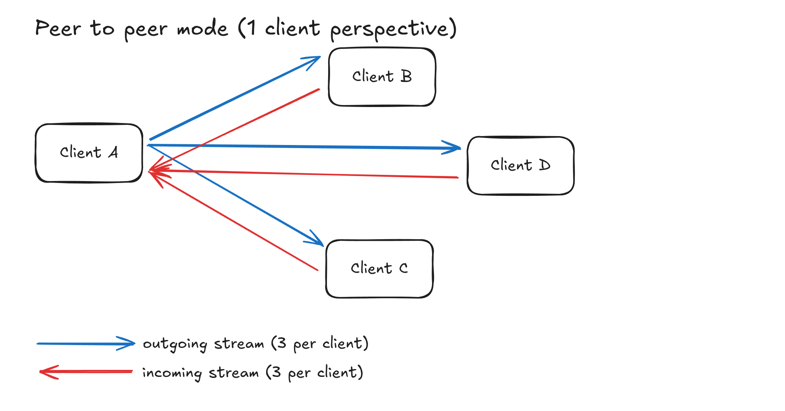

# VirtualClassroomInator

Browser based virtual classroom with text-chat, proximity audio, video & screencast.

## See it in action:

[Deployment here](https://virtualclassroominator.un-indien-dans-la-ville.store/)

IMPORTANT: If you wish to open the website twice to test all the features, make sure you open
the second one either in another browser or in an incognito tab.

## Project Design:

The main premise and challenge of the project is to be able to share webcam/audio/video amongst
users somewhat efficiently, whether in a large group (in a classroom) or in a small one (outside
at a desk or something).

So before we even try and tackle this challenge, I believe it is important to know about the two main
options that we have: `SFU` and `P2P`. Tho a third one exists but is out of the question for this purpose.

We'll start with the `Peer to Peer` option. The below schema shows the end "state" of intercommunication.
Before getting there, there is some setup to do which I won't get in too much details about but basically,
we need a "signaling" server to orchestrate this, when one user want to join the conversation, the server
gives the user's ip(ish) to all other connected users and vise-versa, allowing them to establish a direct
connection with one another.

As we can see from the above schema, p2p seems great because once our setup is done, each user communicates
directly with one another, so almost no server resources are required on our part. However this advantage
might also become our downfall if not careful, indeed managing this direct `mesh` network becomes increasingly
complex as the number of users grow, and most importantly, the amount of outgoing stream per user also grows
linearly, even tho this outgoing stream is always the same.

Which leads us to the second option, a `Selective Forwarding Unit`. The below schema, just like previously, shows
the "end" state of communication. Getting there is very similar to the p2p way, but instead of establishing a
connection with many users, the connection is established to a single server.

As we can see from the above schema, a SFU solves most of our problems, at the cost of server resources.
Managing the network is much easier, one connection per user. And our outgoing stream is not being sent as duplicate,
no matter the amount of participants, effectively dividing by 2 in+out nework usage. (tho there must be a nice
Mathematical term to properly describe it)

### SFU or P2P ?

When in a room, the choice is somewhat obvious, we'll use SFU. Indeed, this mechanism is perfect for "room" based
communication, each user shares the same room, thus all should receive the exact same stream from the exact same
people.

Outside of a room however, when in "proximity" mode, the choice is not so simple, see:

`B` should connect with `A` and `B`, but `A` & `C` should only connect with `B`. This can be done with an SFU,
but it's not common enough of an issue to be supported by default by any of the "clé en main" ones like LiveKit.
We'd need to write a bunch of custom logic ourserves with something like mediasoup which is too much of a hasle
for this pet project in which at most me and myself will ever join at once. P2P on the other hand is perfect for
this purpose, see:

So all of this just to say well use an hybrid approach, SFU for rooms, P2P outside of rooms.

### Overall architecture:

Now that we've solved the main challenge, I can try to justify my
