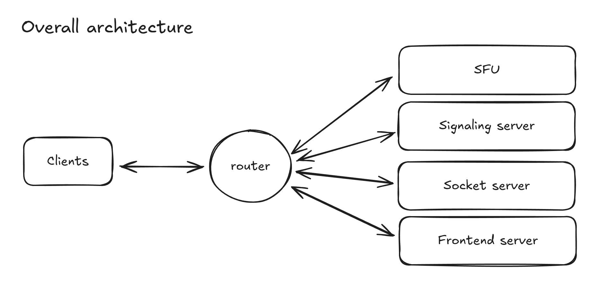
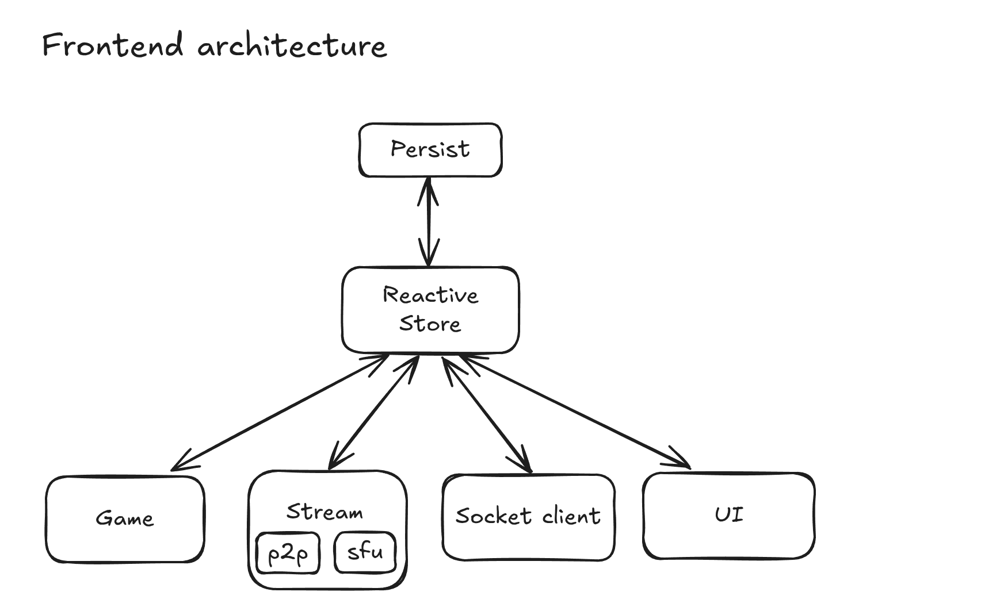

# VirtualClassroomInator

Browser based virtual classroom with text-chat, proximity audio, video & screencast.


## See it in action:

[Deployment here](https://virtualclassroominator.un-indien-dans-la-ville.store/)

IMPORTANT: If you wish to open the website twice to test all the features, make sure you open
the second one either in another browser or in an incognito tab.

## Project Design:

### Sharing video, screen and audio.

The main premise and challenge of the project is to be able to share webcam/audio/video amongst
users somewhat efficiently, whether in a large group (in a classroom) or in a small one (outside
at a desk or something).

So before we even try and tackle this challenge, I believe it is important to know about the two main
options that we have: `SFU` and `P2P`. Tho a third one exists but is out of the question for this purpose.

We'll start with the `Peer to Peer` option. The below schema shows the end "state" of intercommunication.
Before getting there, there is some setup to do which I won't get in too much details about but basically,
we need a "signaling" server to orchestrate this, when one user want to join the conversation, the server
gives the user's ip(ish) to all other connected users and vise-versa, allowing them to establish a direct
connection with one another.


As we can see from the above schema, p2p seems great because once our setup is done, each user communicates
directly with one another, so almost no server resources are required on our part. However this advantage
might also become our downfall if not careful, indeed managing this direct `mesh` network becomes increasingly
complex as the number of users grow, and most importantly, the amount of outgoing stream per user also grows
linearly, even tho this outgoing stream is always the same.

Which leads us to the second option, a `Selective Forwarding Unit`. The below schema, just like previously, shows
the "end" state of communication. Getting there is very similar to the p2p way, but instead of establishing a
connection with many users, the connection is established to a single server.


As we can see from the above schema, a SFU solves most of our problems, at the cost of server resources.
Managing the network is much easier, one connection per user. And our outgoing stream is not being sent as duplicate,
no matter the amount of participants, effectively dividing by 2 in+out nework usage. (tho there must be a nice
Mathematical term to properly describe it)

#### So, should we user SFU or P2P ?

When in a room, the choice is somewhat obvious, we'll use SFU. Indeed, this mechanism is perfect for "room" based
communication, each user shares the same room, thus all should receive the exact same stream from the exact same
people.

Outside of a room however, when in "proximity" mode, the choice is not so simple, see:


`B` should connect with `A` and `B`, but `A` & `C` should only connect with `B`. This can be done with an SFU,
but it's not common enough of an issue to be supported by default by any of the "clé en main" ones like LiveKit.
We'd need to write a bunch of custom logic ourserves with something like mediasoup which is too much of a hassle
for this pet project in which at most me and myself will ever join at once. P2P on the other hand is perfect for
this purpose, see:


_(note: in real use case probably choose sfu as well or at least fallback to it if too many nearby users )_

So all of this just to say well use an hybrid approach, SFU for rooms, P2P outside of rooms.

### Moving our character around and syncing with other users.

The other premise of the project is that to make the whole experence a bit more lively than a zoom call, users
control a character and can move it around in a 2D space.

#### Client vs Server autority

We'll argue the technology chosen in a later section, here we will focus on the more general topic of Server vs
Client authority.

For context, when building real time games, we need to decide whether we give power to the `Client`, or to the
`Server`. Games tend to always prefer the latter, giving complete authority to the server, each client input sends a
request to the server, which validates it, and then dispatches it to other client if the input makes sense. This
prevents players from sending fraudulous inputs & cheating.

At first glance it might seem obvious we should do the same. This part of the app is just like any other game after all.
But like anything, this "safety" comes at a cost: we need to run the whole physics of the game both on the client
and the server. Even tho our physics is basic (collison, player positions & walls postions), it still needs to run at
30-60fps, be kept in sync with the client physics, and feel snappy. And what if we ever need to distrbute our system ?
With the physics running in our server, we can't just duplicate it, glue the two with Redis and call it a day.

I feel like the amount of complexity brought by having to correclty implement server authority while keeping the user
experience snappy (which is much harder than I probably made it seem), largely outweight the benefits. If a smart one
manages to go out of map then so be it.

The approach chosen here is thus full client authority, whatever the client says is right, the role of the server will
just be to `dispatch` inputs from a player to the others. The client can't send gibberish tho, the shape of each message
is still checked before dispatch.

#### Keeping users in sync

Now that we know the client is always right, one question now remains: How do we keep each client in sync ?

The laziest option would be for each player to send his data (position) at 30-60fps and call it a day. This approach
is fine but will end up wasting our resouces. We can surely do better considering our constraints: 2D strict x|y movement.

The approach I chose is to represent a user's position as follows:

```ts
{
    user_id: string,
    position: {x: number, y:number},
    direction: "left" | "right" | "top" | "bottom",
    is_moving: boolean
}
```

When and only when the `is_moving` field changes for a user, the whole position object is sent to the server and then
dispatched to each other client. He himself receives nothing, he start animating his character right away at speed `S`.
Other players receive the message, and since we pass in a `user_id` along with the message, they can animate the right
character. The positions are naturally kept in sync because the animation speed `S` is the same for each client.
When the user stops, same process, the message is dispatched to other clients who know whose charater to stop, and
at which exact position.

The server can't be that "stateless" tho, one issue we might have noticed here is how can someone who just joined know
about the postion of each other players and their ids ? He simply cannot with the current setup. It's also part of the
reason we send the `x`&`y` in each message (despites each client being able to extrapolate one's position without it once
connected). Our server keeps track of each connected client, and to each of those "connections", associates a position
object, which is updated on each message. When a new user connects, it just gets all those position objects to get the initial
gamestate.

There are other parts to keep in sync: Username, status, appearance, etc..., but they all follow the exact same principle,
they are in their own object, when they change just the relevant object is being sent along with a user_id, they are
updated on the server, and dispatched to other users.

### Text Chat

Last premise is the chat part. Which after all we previously said is quite obvious to figure out. We'll just
send a message to a server, the server will dispatch it to another target client.

One interesting thing tho is since it's a portfolio project, I don't want the user to have to connect to
use the app. But we still want our conversations to be persisted, and to be able to continue them (not open
a new one even if talking ot the same person).

To solve the later, the idea is to generate a `user_id` and store it in localstorage on first app connection. On second
app connection, reuse the already created one. This enables having persisted conversations which can be continued even
after both have quit and rejoined the app by indexing them by `user_id` in localstorage. Another cool thing it enables
is an eventually consistent list of participants, also in localstorage (you get the username from the last time you saw
the participant, if he joins with a new username, the list gets updated).

### Overall architecture:

Anyways, it's been some time since the last schema and I need to get my money's worth from my Excalidraw subcription
so:



Basically we have a microservices architecture. Each service is Dockerized individually, composed via a docker compose.
Hosted on a single vps, requests are routed by Caddy. With a little help from Coolify ^^.

We could pack it all into a single Docker container, which would have been much easier, but having everything Dockerized
individually is much more flexible, we could spawn multiple instances of a critical service with few changes, switch from
docker compose to Kubernetes if necessary etc...

#### SFU

TODO

#### Signaling Server

PeerJS: easy to use, battle tested, client library.

#### Socket Server

Socket.io: easy to use, battle tested, client library, most people have aleady used it, very good typescript support with
shared typed front/back.

#### Frontend Server

More details later.

To make everything simpler we use a monorepo. Since it is all written in TypeScript, this enables us to share lint, ts
& formatter configs accross the whole project. Most importantly it allows us to share code between our client and servers.
In this case mostly types: socket events shared by the socket-server and clients. Those types/configs are under the `packages`
directory, and the main apps are under `apps`.

### Frontend architecture:


